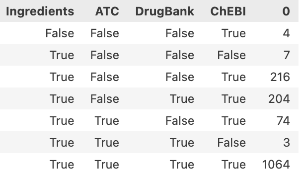
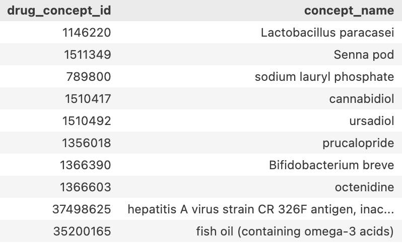
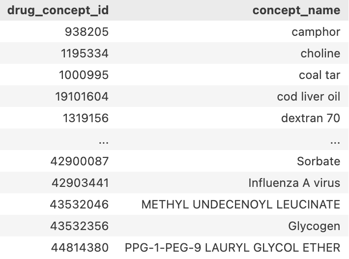
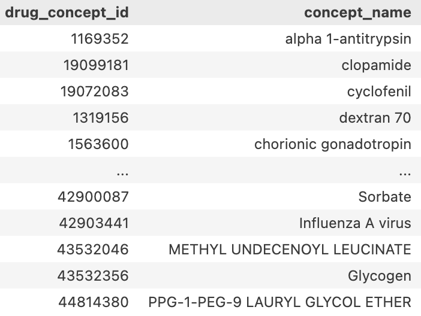

# Exploration on the datasets

 ## Venn diagram and UpSet plot

 ### Handling of the datasets
 
 The dataset was processed for further plotting, and the results are summarized in the table below. It shows the intersections of drugs across four datasets: Ingredients, ATC, DrugBank, and ChEBI. Each row represents a unique combination of whether a drug is present (True) or absent (False) in these datasets, with the corresponding count shown in the rightmost column. The table highlights how many drugs are shared between the datasets and which combinations of presence and absence occur.
 

  
  
<b>Table 1:</b> Drug Intersections

 ### Venn diagram

 The Venn diagram shown below illustrates the overlap of drugs across the four datasets: Ingredients, ATC, DrugBank, and ChEBI. 
  

  
  
<b>Figure 1 </b>

 ### Upset plot

 The UpSet plot shown below provides a detailed visualization of the intersections between the Ingredients, ATC, DrugBank, and ChEBI datasets. It displays the size of each intersection, offering a clearer insight into the distribution of shared and unique drugs across the datasets.
   

  
  
<b>Figure 2 </b>

  ### Overview of the Missing Properties
  
  From the plots and summarized data, several key observations can be made. **ChEBI** and **Ingredients** are almost always present across the datasets. Only 4 drugs lack ingredient information, and just 10 drugs lack a ChEBI code. This is expected, as substances inherently have ingredients, and most drugs tend to have a corresponding ChEBI code due to their chemical nature. Among all missing properties, the absence of an **ATC code** is the most common.

The tables below provide information on a subset of the drugs missing these properties, as displaying all drugs would be impractical due to the large number of entries (e.g. 431 drugs are missing ATC Codes). For the full drug lists of missing properties, see `lacks_atc.csv`, `lacks_drugbank.csv`, `lacks_chebi.csv` and `lacks_ingredients.csv`.

<b>Table 2:</b> Missing Ingredient

<b>Table 3:</b> Missing ChEBI Code

<b>Table 4:</b> Missing ATC Code

<b>Table 5:</b> Missing DrugBank Code

#### Possible Reasons for Missing Information:

- **Missing Ingredients**:
  1. The ingredient information is actually indicated in the drug name, but the dataset fails to capture it.
  2. The drug name refers to a general substance (e.g. **Senna Leaves**), and the active ingredient is not explicitly recorded.

- **Missing ChEBI Code**:
  1. Some drugs missing a ChEBI code actually have one, but it was not recorded due to dataset errors.
  2. The drug name refers to a general substance without a clear active ingredient (e.g. **Senna pod**).
  3. Some drugs do not fit within the ChEBI classification system (e.g. **Lactobacillus paracasei**, a species of probiotic bacteria)

- **Missing ATC Code**:
  1. Certain drugs without an ATC code do have one, but it was omitted due to dataset inaccuracies (e.g. **Camphor**).
  2. The recorded substance is a general substance rather than an active ingredient.
  3. The active ingredient is known but not classified as a therapeutic drug, so it is excluded from the ATC system (e.g. **PPG-1-PEG-9 LAURYL GLYCOL ETHER**, a surfactant used in cosmetics).

- **Missing DrugBank Information**:
  The reasons for missing DrugBank information are similar to those for missing ATC codes, often due to the dataset's omission or the substance not fitting within the DrugBank classification system.

  The 74 drugs that lack only DrugBank seem counterintuitive beacuse if a drug has an ATC Code, it is highly likely that it has DrugBank information. To figure this out, the 74 drugs missing only DrugBank are filtered out (see `lacks_only_drugbank.csv`). It turns out that these drugs are mostly in DrugBank but lack DrugBank information due to the dataset's omission. 

## Analysis on ATC Code

### ATC Code Distributions

The information on the number of unique ATC codes associated with each drug is stored in the file `atc_counts.tsv`. It includes columns for `drug_concept_id`, the corresponding `drug_concept_name`, and the count of distinct ATC codes (`atc_count`) linked to each drug. The dataset is sorted by `atc_count` in ascending order.
The figure below shows the distribution of ATC Codes per drug.

<b>Figure 3</b>

### Drug Classifications

#### First Classification

A bar plot and a pie chart illustrating the distribution of First Level ATC Codes are shown below. It can be seen that the drugs in the dataset are distributed across all 14 first-level ATC codes. The largest categories include 'A: Alimentary Tract and Metabolism' and 'N: Nervous System', which together make up a significant portion of the dataset, as shown by their high counts in the bar chart and larger slices in the pie chart (13.8% and 13.5%, respectively). Other notable categories include 'D: Dermatologicals' and 'C: Cardiovascular System', each contributing over 9% to the total distribution. Smaller categories, such as 'V: Various', 'H: Systemic Hormonal Preparations', and 'P: Antiparasitic Products', represent only a small fraction of the dataset, as indicated by their smaller pie slices and lower counts in the bar chart.

For reference to the ATC classification system and the full class names for the first level ATC codes, please refer to the official [ATC/DDD Index](https://atcddd.fhi.no/atc_ddd_index/). Below is a list of the first-level ATC codes used in this analysis:

- A: Alimentary Tract and Metabolism
- B: Blood and Blood Forming Organs
- C: Cardiovascular System
- D: Dermatologicals
- G: Genito Urinary System and Sex Hormones
- H: Systemic Hormonal Preparations, Excl. Sex Hormones
- J: Antiinfectives for Systemic Use
- L: Antineoplastic and Immunomodulating Agents
- M: Musculo-Skeletal System
- N: Nervous System
- P: Antiparasitic Products, Insecticides and Repellents
- R: Respiratory System
- S: Sensory Organs
- V: Various

<b>Figure 4</b>

<b>Figure 5</b>

#### Second Classification

The table below presents the statistics on the presence of drugs in our dataset, categorized by second-level ATC codes. It highlights the total number of drugs, their presence, absence, and the corresponding percentage of presence for each ATC category.

The table shows that most ATC categories have complete or near-complete drug representation in the dataset, with many categories (e.g., Cardiovascular System, Dermatologicals) showing 100% presence. However, certain categories like "Alimentary Tract and Metabolism" and "Various" have lower representation, with the presence percentages dropping to 81.25% and 55.56%, respectively. This indicates potential gaps in coverage for these specific categories.
| **ATC Code** | **Category**                                                | **Number of Second-Level Codes** | **Presence** | **Absence** | **Presence Percentage**          |
|--------------|-------------------------------------------------------------|------------------|--------------|-------------|-----------------------------------|
| **A**        | Alimentary Tract and Metabolism                              | **16**           | **13**       | **3**       | **81.25%**  |
| **B**        | Blood and Blood Forming Organs                               | **5**            | **4**        | **1**       | **80.00%**  |
| **C**        | Cardiovascular System                                        | **9**            | **9**        | **0**       | **100.00%** |
| **D**        | Dermatologicals                                              | **11**           | **11**       | **0**       | **100.00%** |
| **G**        | Genito Urinary System and Sex Hormones                       | **4**            | **4**        | **0**       | **100.00%** |
| **H**        | Systemic Hormonal Preparations, Excl. Sex Hormones           | **5**            | **5**        | **0**       | **100.00%** |
| **J**        | Antiinfectives for Systemic Use                              | **6**            | **6**        | **0**       | **100.00%** |
| **L**        | Antineoplastic and Immunomodulating Agents                   | **4**            | **4**        | **0**       | **100.00%** |
| **M**        | Musculo-Skeletal System                                      | **6**            | **5**        | **1**       | **83.33%**  |
| **N**        | Nervous System                                               | **7**            | **7**        | **0**       | **100.00%** |
| **P**        | Antiparasitic Products, Insecticides and Repellents          | **3**            | **3**        | **0**       | **100.00%** |
| **R**        | Respiratory System                                           | **6**            | **5**        | **1**       | **83.33%**  |
| **S**        | Sensory Organs                                               | **3**            | **3**        | **0**       | **100.00%** |
| **V**        | Various                                                      | **9**            | **5**        | **4**       | **55.56%**  |
| **SUM**      |                                                              | **94**           | **84**       | **10**      | **89.36%**  |

<b>Table 6: Statistics on the presence of drugs categorized by second-level ATC codes</b>

Below are bar charts showing the distribution of second-level ATC codes for each first-level ATC category. These charts display the percentage of drugs present in our dataset, as well as the absence of drugs (represented by zero percentages). For pie charts illustrating the same distribution, refer to `figures/atc_level2_pie`.

<b>Figure 6 </b>

<b>Figure 7 </b>

<b>Figure 8 </b>

<b>Figure 9 </b>

<b>Figure 10 </b>

<b>Figure 11 </b>

<b>Figure 12 </b>

<b>Figure 13 </b>

<b>Figure 14 </b>

<b>Figure 15 </b>

<b>Figure 16 </b>

<b>Figure 17 </b>

<b>Figure 18 </b>

<b>Figure 19 </b>

