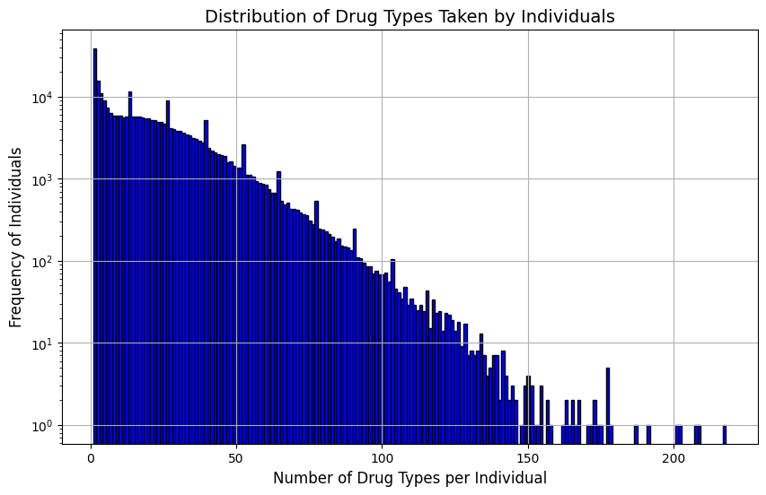

# Exploration on Individual-Level Drug Era

## Overview of the Dataset

As shown in the table, the dataset contains the drug intake records of 281,690 persons and 1,620 unique drugs. 
The unique drugs are mapped to ATC codes with the information in `mappings/drug_era/drug_era_atc.tsv` according to the `drug_concept_id`s. Among the 1,620 unique drugs, 1,141 are mapped to ATC codes, some of which are mapped to multiple ATC codes.

| Name                                    | Number     |
|-----------------------------------------|------------|
| Total number of drug intake records     | 19,959,413 |
| Number of unique drugs                  | 1,620      |
| Unique drugs mapped to ATC codes        | 1,141      |
| Number of unique persons                | 281,690    |

<b>Table 1: Summary of Drug Intake Data</b>

## Analysis of How Many Times Each Drug Is Taken
For all the 1620 unique drugs, the distribution of how many times each drug is taken is analyzed.

The following table shows the summary statistics, which reveals significant variability. While the mean intake is 12,320 times, the median is much lower at 312.5, indicating a skewed distribution. Some drugs are taken only once, while the most frequently used drug is taken 927,199 times, highlighting extreme differences in usage patterns.

| Statistic |    Value    |
|-----------|-------------|
| Count     | 1,620       |
| Mean      | 12,320.625  |
| Std       | 48,440.126  |
| Min       | 1           |
| 25%       | 13          |
| 50%       | 312.5       |
| 75%       | 4,012.5     |
| Max       | 927,199     |

<b>Table 2: Summary Statistics of Drug Intake Counts</b>

To illustrate the frequency distribution of drug intake counts, a series of histograms are presented at varying scales. 
The histograms shown below display the full range and progressively focused intervals from 0 to 200,000, 0 to 20,000, 0 to 2,000, and 0 to 200, allowing for a detailed examination of the distribution at different levels of granularity.  
The histograms reveal a highly skewed distribution of drug intake frequency. Figure 1 shows that most drugs are taken relatively few times, with a long tail extending to high frequencies. Figures 2-5 provide increasingly detailed views of the lower frequency ranges. This pattern suggests that while there are many drugs in the dataset, a small number of commonly prescribed medications account for a disproportionately large share of total drug intakes, while numerous specialized or less common drugs are taken infrequently.

<b>Figure 1</b>

<b>Figure 2</b>

<b>Figure 3</b>

<b>Figure 4</b>

<b>Figure 5</b>

Among the 1,620 unique drugs, there are **126** drugs that are taken only once. The top 100 most frequently taken drugs and the 126 drugs taken only once are extracted and mapped to their corresponding ATC codes.   
The following tables shows the top 10 most frequently taken drugs and part of the bottom 10 least frequently taken drugs. Note that the ATC information of levothyroxine is added manually here and this is not included in the 1141 drugs mapped to ATC codes in the original dataset.
The top 10 most consumed drugs include common analgesics like aspirin and acetaminophen, antibiotics such as amoxicillin, and medications for chronic conditions like levothyroxine and simvastatin, indicating high usage for pain relief, infection treatment, and long-term health management. The drugs taken only once include specialized medications like carfilzomib (cancer treatment), secukinumab (immunosuppressant), and etravirine (HIV medication). The rarity of these drugs suggests they may be prescribed for specific, less common conditions or represent newer, more specialized treatments in the dataset.  
See `notebooks/eda/times_top_100_with_info.csv` and `notebooks/eda/times_bottom_126_with_info.csv` for more details.

| Drug Name       | Times Taken | ATC Code(s)                                      |
|-----------------|-------------|--------------------------------------------------|
| aspirin         | 927199      | A01AD05, B01AC06, N02BA01                        |
| acetaminophen   | 712882      | N02BE01                                          |
| amoxicillin     | 555088      | J01CA04                                          |
| codeine         | 406766      | R05DA04                                          |
| beclomethasone  | 378066      | A07EA07, D07AC15, R01AD01, R03BA01               |
| levothyroxine   | 365952      | H03AA01                                          |
| albuterol       | 361312      | R03AC02, R03CC02                                 |
| estradiol       | 340392      | G03CA03                                          |
| hydrocortisone  | 334357      | A01AC03, A07EA02, C05AA01, D07AA02, D07XA01, H02AB09, S01BA02, S01CB03, S02BA01 |
| simvastatin     | 333229      | C10AA01                                          |

<b>Table 3: Top 10 Most Frequently Taken Drugs</b>

| Drug Name                    | Times Taken | ATC Code(s)             |
|------------------------------|-------------|-------------------------|
| carfilzomib                  | 1           | L01XG02                 |
| 17-alpha-hydroxyprogesterone | 1           | G03DA03                 |
| levobupivacaine              | 1           | N01BB10                 |
| secukinumab                  | 1           | L04AC10                 |
| etravirine                   | 1           | J05AG04                 |
| aflibercept                  | 1           | S01LA05, L01XX44        |
| sertindole                   | 1           | N05AE03                 |
| dabrafenib                   | 1           | L01EC02                 |
| axitinib                     | 1           | L01EK01                 |
| mesna                        | 1           | R05CB05, V03AF01        |

<b>Table 4: Sample of 10 Drugs from Those Taken Only Once</b>

## Analysis of How Many People Take Each Drug
For all the 1,620 unique drugs, the distribution of how many people take each drug is analyzed.

The following table shows the summary statistics.
The data shows significant variation in drug usage across 1,620 unique drugs. While some drugs are taken by only one person, others are used by up to 141,912 individuals. The distribution is skewed, with a median of 121 users per drug, but a much higher mean of 3,674 due to widely-used medications.

| Statistic |    Value     |
|-----------|--------------|
| Count     | 1,620        |
| Mean      | 3,674.214815 |
| Std       | 11,299.932931|
| Min       | 1            |
| 25%       | 7            |
| 50%       | 121          |
| 75%       | 1,411.5      |
| Max       | 141,912      |

<b>Table 5: Summary Statistics of the Number of People Taking Each Drug</b>

To illustrate the frequency distribution of the number of people taking each drug, a series of histograms are presented at varying scales.  
The histograms reveal a highly skewed distribution in the number of people taking each drug. Figure 6 shows the full range, with a long tail extending to high user counts. Figures 7-9 provide increasingly detailed views of the lower ranges. This pattern indicates that while most drugs are taken by relatively few people, a small number of widely prescribed medications are used by a large portion of the population. The distribution suggests a power law relationship, with a few common drugs dominating usage and many specialized medications used by only a small number of individuals.

<b>Figure 6</b>

<b>Figure 7</b>

<b>Figure 8</b>

<b>Figure 9</b>

Among the 1,620 unique drugs, there are **157** drugs taken by only one person. The top 100 drugs taken by most people and the 157 drugs taken by only one person are extracted and mapped to their corresponding ATC codes.  
Tables 6 and 7 showing the top 10 drugs and part of the bottom 10 drugs illustrates the stark contrast in drug usage patterns. The most widely used drugs, such as amoxicillin and acetaminophen, are taken by over 100,000 patients each, reflecting common treatments for infections and pain. In contrast, drugs taken by only one person include specialized medications like evolocumab (for cholesterol) and tofacitinib (an immunosuppressant). This disparity highlights the range from widely prescribed, general-use medications to highly specialized treatments for rare conditions or specific patient needs.
See `notebooks/eda/people_top_100_with_info.csv` and `notebooks/eda/people_bottom_157_with_info.csv` for more details.

| Drug Name      | Patients | ATC Code(s)                                                                 |
|----------------|----------|-----------------------------------------------------------------------------|
| amoxicillin    | 141,912  | J01CA04                                                                     |
| acetaminophen  | 116,112  | N02BE01                                                                     |
| hydrocortisone | 108,940  | A01AC03, A07EA02, C05AA01, D07AA02, D07XA01, H02AB09, S01BA02, S01CB03, S02BA01 |
| codeine        | 102,314  | R05DA04                                                                     |
| diclofenac     | 95,165   | D11AX18, M01AB05, M02AA15, S01BC03                                         |
| ibuprofen      | 93,572   | C01EB16, G02CC01, M01AE01, M02AA13, R02AX02                                 |
| floxacillin    | 89,222   | J01CF05                                                                     |
| omeprazole     | 82,127   | A02BC01                                                                     |
| betamethasone  | 71,320   | A07EA04, C05AA05, D07AC01, D07XC01, H02AB01, R01AD06, R03BA04, S01BA06, S01CB04, S02BA07, S03BA03 |
| trimethoprim   | 67,857   | J01EA01                                                                     |

<b>Table 6: Top 10 Drugs Taken by Most People</b>

| Drug Name         | Patients | ATC Code(s)                 |
|-------------------|----------|-----------------------------|
| calcium chloride  | 1        | A12AA07, B05XA07, G04BA03    |
| calcifediol       | 1        | H05BX05, A11CC06             |
| magaldrate        | 1        | A02AD02                      |
| evolocumab        | 1        | C10AX13                      |
| lactitol          | 1        | A06AD12                      |
| sodium acetate    | 1        | B05XA08                      |
| tofacitinib       | 1        | L04AF01                      |
| paromomycin       | 1        | A07AA06                      |
| azacitidine       | 1        | L01BC07                      |
| poldine           | 1        | A03AB11                      |

<b>Table 7: Sample of 10 Drugs Taken by Only One Person</b>

## Analysis of How Many Times Each Person Takes Each Drug

The distribution of how many times each of the 281,690 persons takes each of the 1,620 drugs is analyzed.

The following table shows the summary statistics. With 5,952,228 person-drug combinations, the average intake is 3.35 times, but the median is just 1. This indicates most people take each drug infrequently, while some take certain medications much more often. The range spans from 1 to 155 intakes, highlighting significant variability in individual drug usage patterns.

| Statistic |   Value   |
|-----------|-----------|
| Count     | 5,952,228 |
| Mean      | 3.353268  |
| Std       | 6.231562  |
| Min       | 1         |
| 25%       | 1         |
| 50%       | 1         |
| 75%       | 3         |
| Max       | 155       |

<b>Table 8: Summary Statistics of the Number of Times Each Person Takes Each Drug</b>

The histogram below illustrates the frequency distribution of drug intake per person. It shows a highly skewed distribution, with most person-drug combinations having low intake frequencies (1-3 times). There's a long tail extending to higher frequencies, indicating that while most drug uses are infrequent, some individuals take certain medications much more regularly, possibly for chronic conditions.

<b>Figure 10</b>

## Analysis of How Many Unique Drugs Each Person Takes

For all the 281,690 persons, the distribution of how many unique drugs each person takes is analyzed.

The following table shows the summary statistics. On average, each person takes 21 unique drugs, with a median of 17. The range spans from 1 to 218 drugs per person, indicating diverse medication needs across the population. Most people use between 5 and 31 different drugs.

| Statistic | Value    |
|-----------|----------|
| Count     | 281,690  |
| Mean      | 21.130420|
| Std       | 19.369678|
| Min       | 1        |
| 25%       | 5        |
| 50%       | 17       |
| 75%       | 31       |
| Max       | 218      |

<b>Table 9: Summary Statistics of the Number of Unique Drugs Each Person Takes</b>

The histogram below shows a right-skewed distribution of unique drugs taken per person. Most people take between 1-40 unique drugs, with a peak around 10-20. A long tail extends to 200+ drugs for some individuals.

<b>Figure 11</b>

To find out what drugs have been taken by the people who take most variety of unique drugs, the drugs taken by each of the top 5 people having taken most variety of unique drugs are extracted and mapped to their corresponding ATC codes. For the drugs that have multiple ATC codes, all the ATC codes are kept in the mapping and for the analysis.  
The top 5 people have taken 218, 209, 208, 202, and 201 unique drugs respectively and are referred to as subject 1, 2, 3, 4 and 5 in the following tables.  
Tables 10-13 show the ATC composition of the drugs taken by each of the subjects. Based on the tables, we can observe that the top 5 subjects with the highest drug variety show similar patterns in their medication usage:
1. They consistently use drugs from all major ATC categories, with a focus on alimentary tract, dermatological, and sensory organ medications.
2. Antibiotics (J01) and corticosteroids (D07) are among the most common drug types across all subjects.
3. At the more detailed ATC levels, there's a high prevalence of drugs for ear conditions (S02AA), oral health (A01AB), and nasal treatments (R01AD).  

These similarities suggest complex medical histories or conditions requiring diverse treatments across multiple body systems.

| ATC level 1 | Subject 1 | Subject 2 | Subject 3 | Subject 4 | Subject 5 |
|-------------|-----------|-----------|-----------|-----------|-----------|
| A: Alimentary Tract and Metabolism | 55 | 53 | 59 | 66 | 50 |
| B: Blood and Blood Forming Organs | 13 | 11 | 14 | 14 | 12 |
| C: Cardiovascular System | 23 | 26 | 27 | 30 | 19 |
| D: Dermatologicals | 54 | 48 | 47 | 52 | 44 |
| G: Genito Urinary System and Sex Hormones | 26 | 20 | 15 | 14 | 15 |
| H: Systemic Hormonal Preparations, Excl. Sex Hormones | 8 | 6 | 7 | 6 | 5 |
| J: Antiinfectives for Systemic Use | 22 | 21 | 28 | 20 | 24 |
| L: Antineoplastic and Immunomodulating Agents | 3 | 6 | 1 | - | 1 |
| M: Musculo-Skeletal System | 13 | 17 | 18 | 8 | 19 |
| N: Nervous System | 27 | 49 | 33 | 10 | 23 |
| P: Antiparasitic Products, Insecticides and Repellents | 4 | 7 | 3 | 3 | 3 |
| R: Respiratory System | 33 | 37 | 38 | 51 | 34 |
| S: Sensory Organs | 56 | 48 | 52 | 60 | 55 |
| V: Various | 1 | 4 | 4 | 3 | 3 |

<b>Table 10: ATC level 1 composition of the drugs taken by each of the subjects</b>

| subject 1 |    | | subject 2 |    | | subject 3 |    | | subject 4 |    | | subject 5 |    |
|-----------|----|-|-----------|----|-|-----------|----|-|-----------|----|-|-----------|----|
| ATC level 2 | count | | ATC level 2 | count | | ATC level 2 | count | | ATC level 2 | count | | ATC level 2 | count |
| S01 | 33 | | S01 | 26 | | S01 | 30 | | S01 | 37 | | S01 | 33 |
| D07 | 17 | | J01 | 17 | | J01 | 22 | | D07 | 19 | | J01 | 17 |
| J01 | 15 | | D07 | 16 | | D07 | 18 | | R01 | 17 | | D07 | 14 |
| S02 | 15 | | A01 | 14 | | S02 | 14 | | J01 | 17 | | S02 | 13 |
| A01 | 14 | | S02 | 14 | | A01 | 13 | | R03 | 17 | | A01 | 11 |
| G01 | 12 | | N06 | 14 | | A10 | 13 | | A01 | 14 | | M01 | 11 |
| R01 | 10 | | R03 | 13 | | N02 | 13 | | S02 | 14 | | A11 | 10 |
| G04 | 10 | | N02 | 13 | | R03 | 12 | | A07 | 13 | | A07 | 9 |
| C05 | 10 | | A07 | 11 | | M01 | 10 | | G01 | 11 | | S03 | 9 |
| D01 | 10 | | N05 | 11 | | A02 | 9 | | A11 | 10 | | R02 | 8 |

<b>Table 11: Top 10 ATC level 2 categories for each of the subjects</b>

| subject 1 |    | | subject 2 |    | | subject 3 |    | | subject 4 |    | | subject 5 |    |
|-----------|----|-|-----------|----|-|-----------|----|-|-----------|----|-|-----------|----|
| ATC level 3 | count | | ATC level 3 | count | | ATC level 3 | count | | ATC level 3 | count | | ATC level 3 | count |
| A01A | 14 | | A01A | 14 | | A01A | 13 | | R01A | 16 | | M01A | 11 |
| G01A | 12 | | N06A | 14 | | S01A | 11 | | A01A | 14 | | A01A | 11 |
| D07A | 11 | | D07A | 10 | | D07A | 11 | | S01A | 12 | | S01A | 10 |
| S01B | 10 | | G01A | 9 | | M01A | 10 | | D07A | 12 | | S01B | 9 |
| R01A | 10 | | C05A | 9 | | S01B | 9 | | G01A | 11 | | D07A | 9 |
| D01A | 9 | | S01B | 9 | | R01A | 9 | | A06A | 9 | | R01A | 8 |
| S02A | 9 | | M01A | 9 | | A10A | 8 | | S01B | 9 | | R02A | 8 |
| C05A | 9 | | R01A | 9 | | S02A | 8 | | S02A | 9 | | S02A | 7 |
| S01A | 8 | | S01A | 8 | | A02B | 8 | | C05A | 8 | | C05A | 7 |
| M01A | 7 | | S02A | 8 | | G01A | 8 | | R02A | 8 | | R06A | 7 |

<b>Table 12: Top 10 ATC level 3 categories for each of the subjects</b>

| subject 1 |    | | subject 2 |    | | subject 3 |    | | subject 4 |    | | subject 5 |    |
|-----------|----|-|-----------|----|-|-----------|----|-|-----------|----|-|-----------|----|
| ATC level 4 | count | | ATC level 4 | count | | ATC level 4 | count | | ATC level 4 | count | | ATC level 4 | count |
| S02AA | 9 | | S02AA | 8 | | S02AA | 8 | | S02AA | 9 | | S02AA | 7 |
| A01AB | 8 | | A01AB | 7 | | S01AA | 8 | | S01AA | 9 | | S03AA | 6 |
| R01AD | 7 | | R01AD | 7 | | H02AB | 7 | | R01AD | 8 | | A01AB | 6 |
| H02AB | 6 | | S01BA | 6 | | A01AB | 7 | | A01AB | 7 | | R01AD | 6 |
| S01BA | 6 | | M02AA | 5 | | R01AD | 7 | | S03AA | 6 | | M02AA | 6 |
| C05AA | 5 | | C05AA | 5 | | S01BA | 6 | | S01BA | 6 | | A11HA | 5 |
| S03AA | 5 | | S03AA | 5 | | M02AA | 6 | | R03BA | 6 | | S01AA | 5 |
| S01AA | 5 | | S01AA | 5 | | D06AX | 5 | | S01GX | 6 | | S01BA | 5 |
| M02AA | 5 | | R03BA | 5 | | S03AA | 5 | | H02AB | 5 | | S01BC | 4 |
| G01AF | 5 | | H02AB | 5 | | C05AA | 5 | | A07EA | 5 | | S02BA | 4 |

<b>Table 13: Top 10 ATC level 4 categories for each of the subjects</b>

