# Analysis on ATC Code

## ATC Code Distributions

The information on the number of unique ATC codes associated with each drug is stored in the file `atc_counts.tsv`. It includes columns for `drug_concept_id`, the corresponding `drug_concept_name`, and the count of distinct ATC codes (`atc_count`) linked to each drug. The dataset is sorted by `atc_count` in ascending order.
The figure below shows the distribution of ATC Codes per drug.

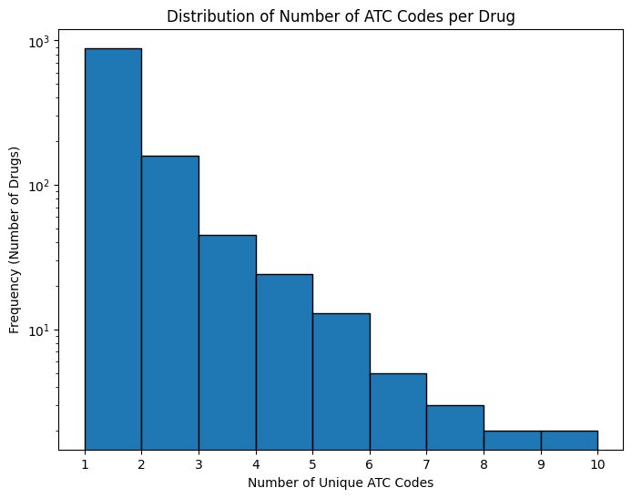

<b>Figure 3</b>

## Drug Classifications

### First Classification

A bar plot and a pie chart illustrating the distribution of First Level ATC Codes are shown below. It can be seen that the drugs in the dataset are distributed across all 14 first-level ATC codes. The largest categories include 'A: Alimentary Tract and Metabolism' and 'N: Nervous System', which together make up a significant portion of the dataset, as shown by their high counts in the bar chart and larger slices in the pie chart (13.8% and 13.5%, respectively). Other notable categories include 'D: Dermatologicals' and 'C: Cardiovascular System', each contributing over 9% to the total distribution. Smaller categories, such as 'V: Various', 'H: Systemic Hormonal Preparations', and 'P: Antiparasitic Products', represent only a small fraction of the dataset, as indicated by their smaller pie slices and lower counts in the bar chart.

For reference to the ATC classification system and the full class names for the first level ATC codes, please refer to the official [ATC/DDD Index](https://atcddd.fhi.no/atc_ddd_index/). Below is a list of the first-level ATC codes used in this analysis:

- A: Alimentary Tract and Metabolism
- B: Blood and Blood Forming Organs
- C: Cardiovascular System
- D: Dermatologicals
- G: Genito Urinary System and Sex Hormones
- H: Systemic Hormonal Preparations, Excl. Sex Hormones
- J: Antiinfectives for Systemic Use
- L: Antineoplastic and Immunomodulating Agents
- M: Musculo-Skeletal System
- N: Nervous System
- P: Antiparasitic Products, Insecticides and Repellents
- R: Respiratory System
- S: Sensory Organs
- V: Various

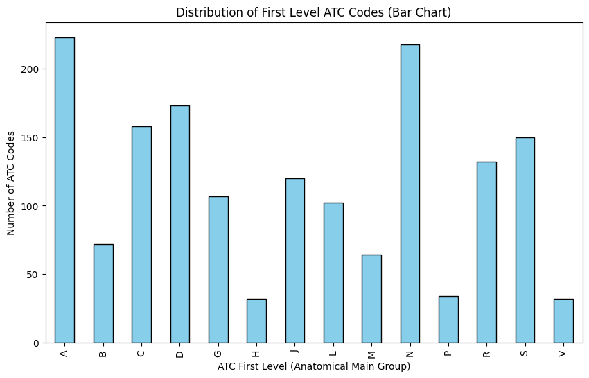

<b>Figure 4</b>

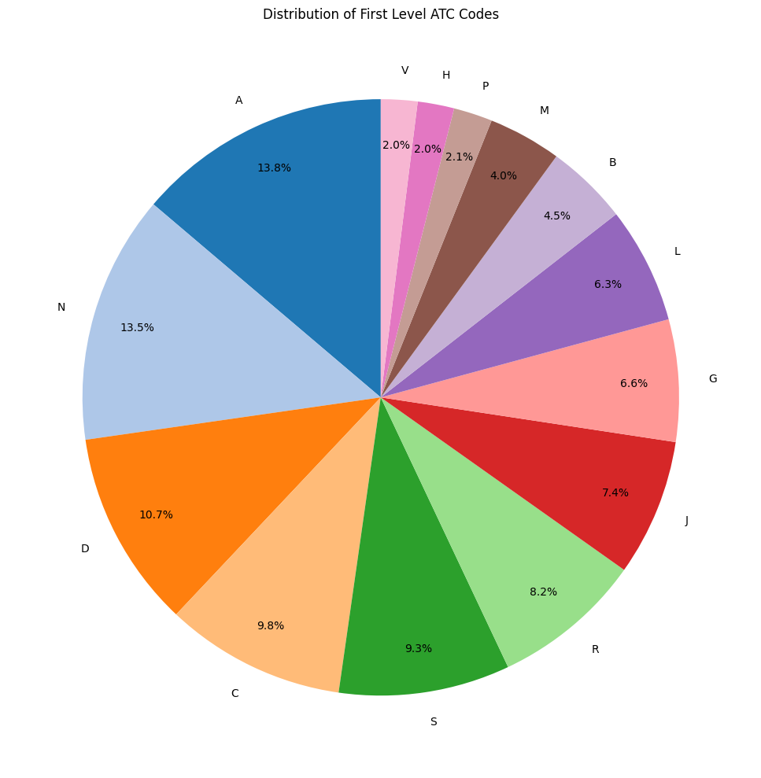

<b>Figure 5</b>

### Second Classification

The table below presents the statistics on the presence of drugs in our dataset, categorized by second-level ATC codes. It highlights the total number of drugs, their presence, absence, and the corresponding percentage of presence for each ATC category.

The table shows that most ATC categories have complete or near-complete drug representation in the dataset, with many categories (e.g., Cardiovascular System, Dermatologicals) showing 100% presence. However, certain categories like "Alimentary Tract and Metabolism" and "Various" have lower representation, with the presence percentages dropping to 81.25% and 55.56%, respectively. This indicates potential gaps in coverage for these specific categories.
| **ATC Code** | **Category**                                                | **Number of Second-Level Codes** | **Presence** | **Absence** | **Presence Percentage**          |
|--------------|-------------------------------------------------------------|------------------|--------------|-------------|-----------------------------------|
| **A**        | Alimentary Tract and Metabolism                              | **16**           | **13**       | **3**       | **81.25%**  |
| **B**        | Blood and Blood Forming Organs                               | **5**            | **4**        | **1**       | **80.00%**  |
| **C**        | Cardiovascular System                                        | **9**            | **9**        | **0**       | **100.00%** |
| **D**        | Dermatologicals                                              | **11**           | **11**       | **0**       | **100.00%** |
| **G**        | Genito Urinary System and Sex Hormones                       | **4**            | **4**        | **0**       | **100.00%** |
| **H**        | Systemic Hormonal Preparations, Excl. Sex Hormones           | **5**            | **5**        | **0**       | **100.00%** |
| **J**        | Antiinfectives for Systemic Use                              | **6**            | **6**        | **0**       | **100.00%** |
| **L**        | Antineoplastic and Immunomodulating Agents                   | **4**            | **4**        | **0**       | **100.00%** |
| **M**        | Musculo-Skeletal System                                      | **6**            | **5**        | **1**       | **83.33%**  |
| **N**        | Nervous System                                               | **7**            | **7**        | **0**       | **100.00%** |
| **P**        | Antiparasitic Products, Insecticides and Repellents          | **3**            | **3**        | **0**       | **100.00%** |
| **R**        | Respiratory System                                           | **6**            | **5**        | **1**       | **83.33%**  |
| **S**        | Sensory Organs                                               | **3**            | **3**        | **0**       | **100.00%** |
| **V**        | Various                                                      | **9**            | **5**        | **4**       | **55.56%**  |
| **SUM**      |                                                              | **94**           | **84**       | **10**      | **89.36%**  |

<b>Table 6: Statistics on the presence of drugs categorized by second-level ATC codes</b>

Below are bar charts showing the distribution of second-level ATC codes for each first-level ATC category. These charts display the percentage of drugs present in our dataset, as well as the absence of drugs (represented by zero percentages). For pie charts illustrating the same distribution, refer to `figures/atc_level2_pie`.

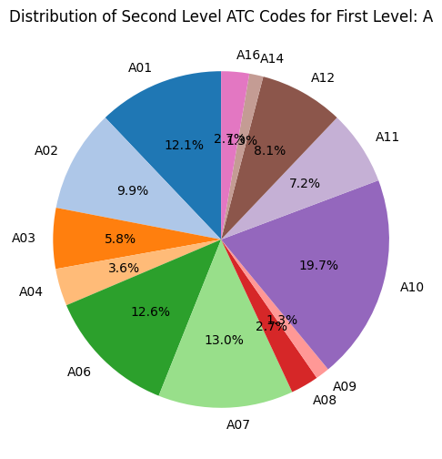

<b>Figure 6 </b>

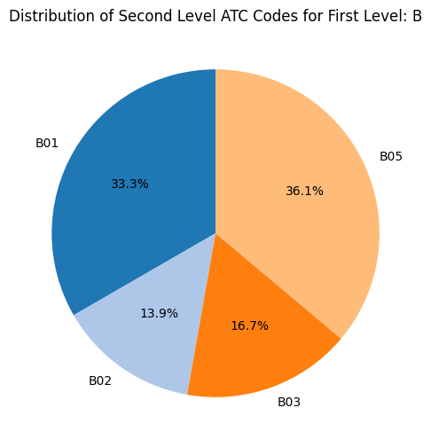

<b>Figure 7 </b>

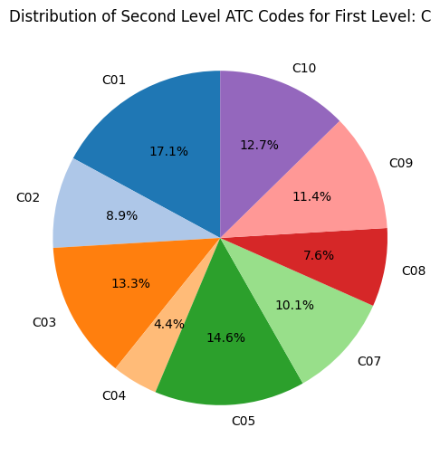

<b>Figure 8 </b>

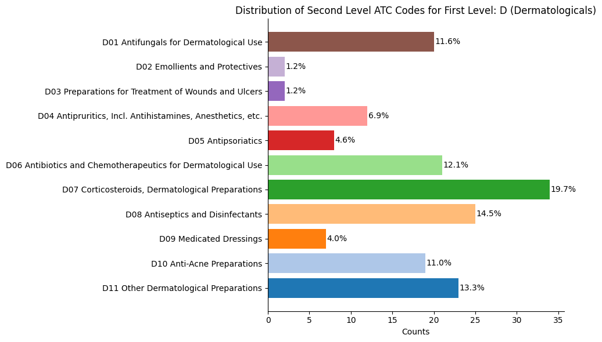

<b>Figure 9 </b>

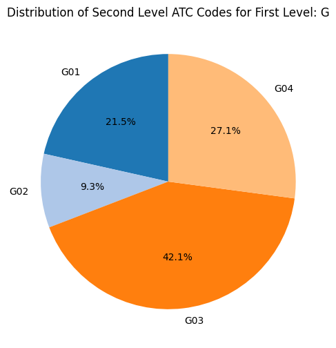

<b>Figure 10 </b>

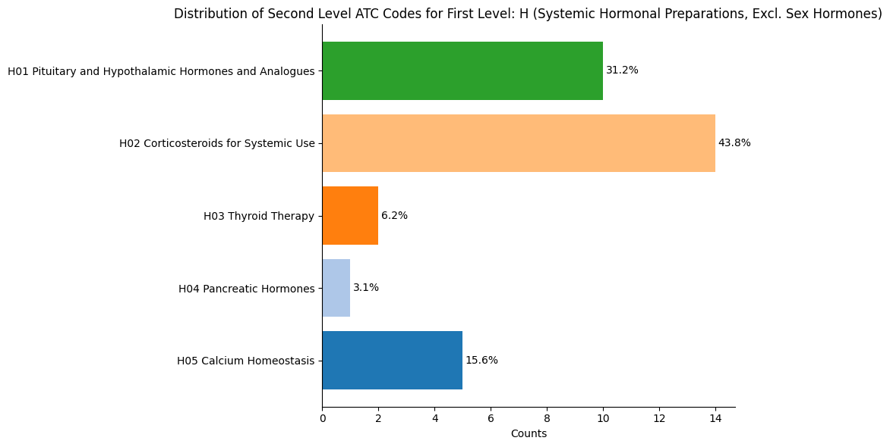

<b>Figure 11 </b>

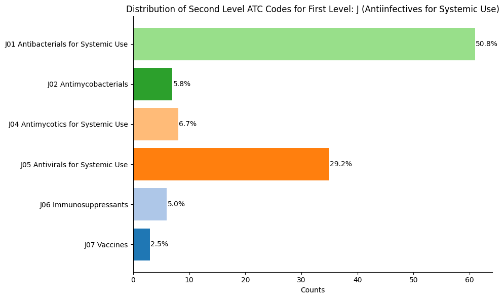

<b>Figure 12 </b>

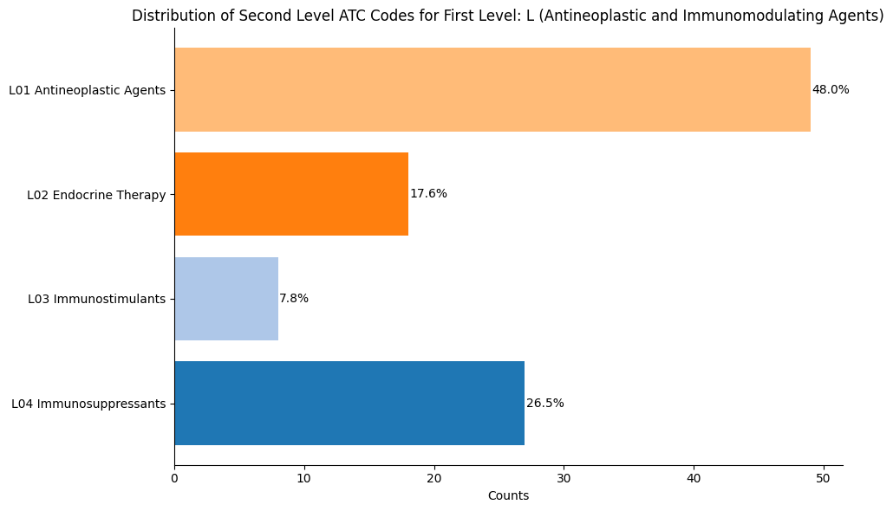

<b>Figure 13 </b>

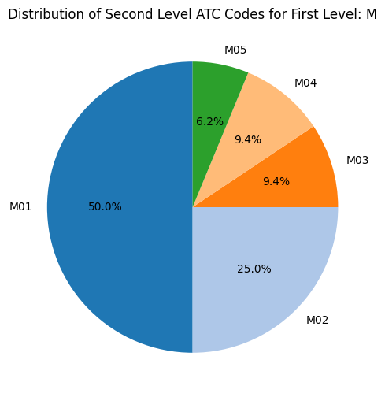

<b>Figure 14 </b>

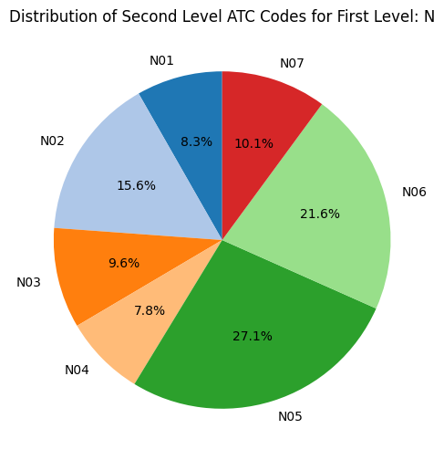

<b>Figure 15 </b>

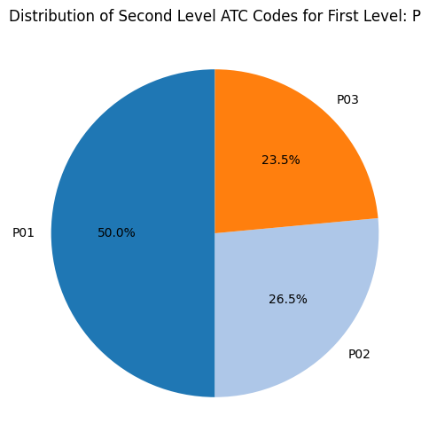

<b>Figure 16 </b>

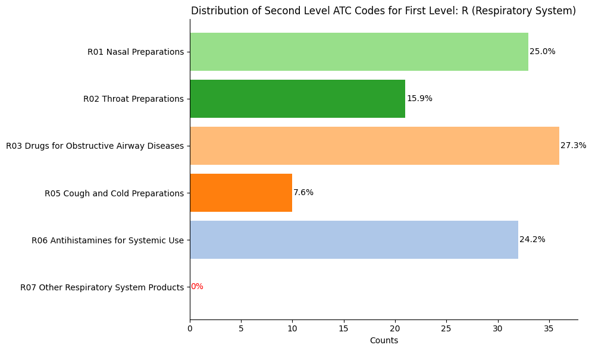

<b>Figure 17 </b>

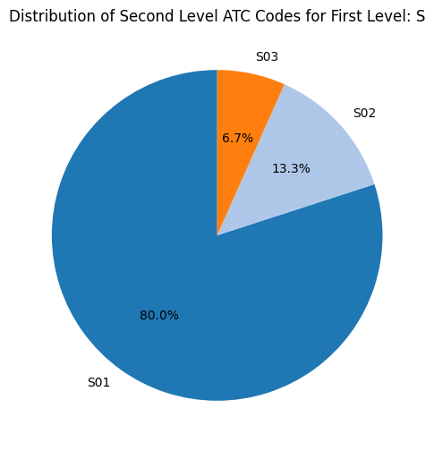

<b>Figure 18 </b>

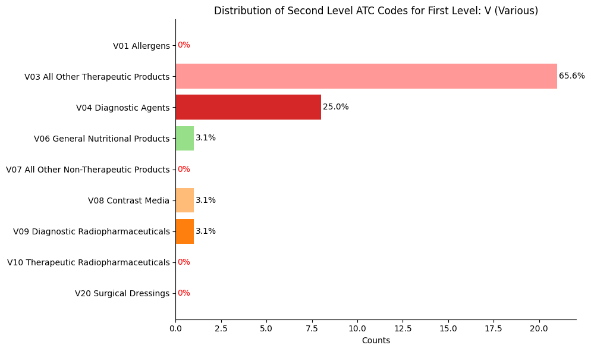

<b>Figure 19 </b>

