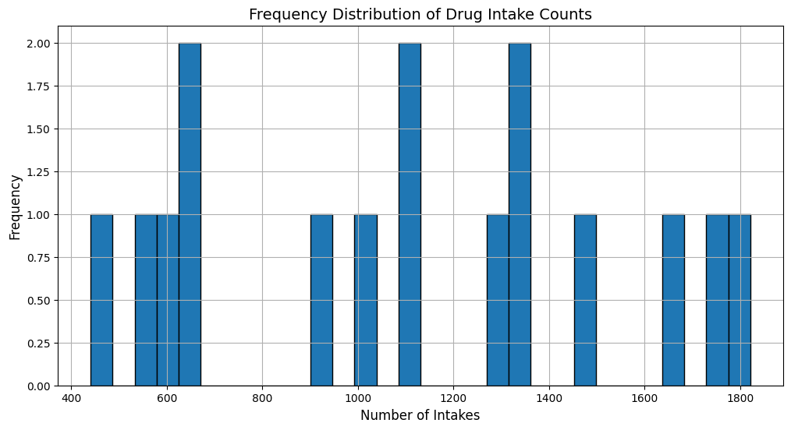
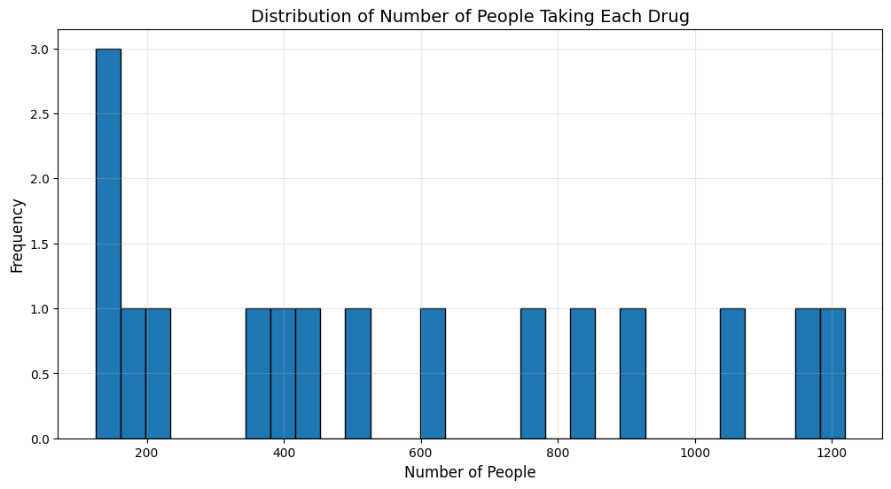
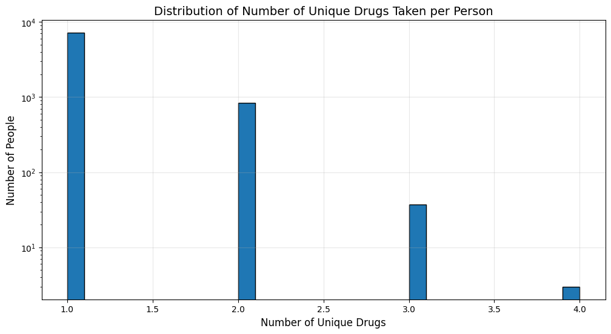

# Introduction to the Focused Dataset

## Dataset Preparation Process

The dataset was refined through the following steps:

1. Initial filtering: Records were selected where drug intake times fell between the median and upper quartile of the distribution.

2. Secondary filtering: From the resulting set, records were further filtered to include only those where the number of people taking the drug was between the median and upper quartile of the distribution.

3. ATC code-based sampling: The remaining records were sampled based on ATC (Anatomical Therapeutic Chemical) codes. Six second-level ATC codes were selected: A10, J01, L01, N05, N06, and S01.

4. Drug selection: For each of the 6 selected ATC codes, 3 drugs were randomly sampled, resulting in 18 drugs.

5. Final adjustment: 2 drugs were removed from the sample due to significantly more frequent intake times compared to the others.

This process resulted in a focused dataset containing 16 unique drugs.

## EDA of the Focused Dataset

### Overview of the Dataset

The focused dataset provides a concentrated view of drug intake patterns for a select group of medications. This refined dataset, derived from a larger collection, offers insights into 16 unique drugs across various therapeutic categories. 

| Name                                    | Number     |
|-----------------------------------------|------------|
| Total number of drug intake records     | 17,668     |
| Number of unique drugs                  | 18         |
| Number of unique persons                | 8,117    |

<b>Table 1: Overview of the Focused Dataset</b>

| Concept Name      | ATC Code         |
|-------------------|------------------|
| exenatide         | A10BJ01          |
| linagliptin       | A10BH05          |
| vildagliptin      | A10BH02          |
| cefuroxime        | J01DC02, S01AA27 |
| levofloxacin      | J01MA12, S01AE05 |
| chlortetracycline | J01AA03, S01AA02 |
| tobramycin        | J01GB01, S01AA12 |
| eflornithine      | L01XX79          |
| hydroxyurea       | L01XX05          |
| mercaptopurine    | L01BB02          |
| midazolam         | N05CD08          |
| methotrimeprazine | N05AA02          |
| modafinil         | N06BA07          |
| rivastigmine      | N06DA03          |
| acetazolamide     | S01EC01          |
| lodoxamide        | S01GX05          |

<b>Table 2: All Drugs in the Focused Dataset</b>

### Distribution of How Many Times Each Drug Is Taken

The distribution of drug intake frequency appears relatively smooth, without significant gaps or clusters, suggesting a continuous spectrum of usage across the 16 drugs. This smooth distribution indicates a gradual variation in how often different medications are taken, which could reflect a diverse range of factors including dosage requirements, treatment durations, and patient adherence patterns across various therapeutic categories.

| Statistic | Value     |
|-----------|-----------|
| count     | 16        |
| mean      | 1104.25   |
| std       | 449.60    |
| min       | 441       |
| 25%       | 625.75    |
| 50%       | 1113      |
| 75%       | 1376.75   |
| max       | 1821      |

<b>Table 3: Statistics of Drug Intake Frequency</b>

| rank | concept_name      | atc_code          | count |
|------|-------------------|-------------------|-------|
| 1    | lodoxamide        | S01GX05           | 1821  |
| 2    | acetazolamide     | S01EC01           | 1751  |
| 3    | eflornithine      | L01XX79           | 1648  |
| 4    | cefuroxime        | J01DC02, S01AA27  | 1496  |
| 5    | midazolam         | N05CD08           | 1337  |
| 6    | exenatide         | A10BJ01           | 1322  |
| 7    | levofloxacin      | J01MA12, S01AE05  | 1294  |
| 8    | modafinil         | N06BA07           | 1124  |
| 9    | hydroxyurea       | L01XX05           | 1102  |
| 10   | methotrimeprazine | N05AA02           | 1030  |
| 11   | linagliptin       | A10BH05           | 911   |
| 12   | mercaptopurine    | L01BB02           | 626   |
| 13   | tobramycin        | J01GB01, S01AA12  | 625   |
| 14   | vildagliptin      | A10BH02           | 592   |
| 15   | chlortetracycline | J01AA03, S01AA02  | 548   |
| 16   | rivastigmine      | N06DA03           | 441   |

<b>Table 4: The Count of How Many Times Each Drug Is Taken</b>

<b>Figure 1</b>

### Distribution of How Many People Take Each Drug

The distribution of the number of people taking each drug shows a relatively smooth pattern, without significant gaps or clusters, indicating a gradual variation in usage across the 16 drugs in the focused dataset. 

| Statistic | Value |
|-----------|-------|
| count     | 16    |
| mean      | 565   |
| std       | 377   |
| min       | 125   |
| 25%       | 204   |
| 50%       | 464   |
| 75%       | 853   |
| max       | 1219  |

<b>Table 5: Statistics of the Number of People Taking Each Drug</b>

| rank | concept_name      | atc_code          | count |
|------|-------------------|-------------------|-------|
| 1    | midazolam         | N05CD08           | 1219  |
| 2    | acetazolamide     | S01EC01           | 1157  |
| 3    | cefuroxime        | J01DC02, S01AA27  | 1039  |
| 4    | levofloxacin      | J01MA12, S01AE05  | 908   |
| 5    | methotrimeprazine | N05AA02           | 835   |
| 6    | lodoxamide        | S01GX05           | 757   |
| 7    | linagliptin       | A10BH05           | 629   |
| 8    | tobramycin        | J01GB01, S01AA12  | 497   |
| 9    | exenatide         | A10BJ01           | 430   |
| 10   | eflornithine      | L01XX79           | 388   |
| 11   | chlortetracycline | J01AA03, S01AA02  | 368   |
| 12   | rivastigmine      | N06DA03           | 213   |
| 13   | modafinil         | N06BA07           | 177   |
| 14   | hydroxyurea       | L01XX05           | 159   |
| 15   | vildagliptin      | A10BH02           | 144   |
| 16   | mercaptopurine    | L01BB02           | 125   |

<b>Table 6: The Count of How Many People Take Each Drug</b>

<b>Figure 2</b>

### Distribution of How Many Unique Drugs Each Person Takes

| Statistic | Value     |
|-----------|-----------|
| count     | 8,117     |
| mean      | 1.11      |
| std       | 0.34      |
| min       | 1         |
| 25%       | 1         |
| 50%       | 1         |
| 75%       | 1         |
| max       | 4         |

<b>Table 7: Statistics of Unique Drugs Taken per Person</b>

| Number of Drugs Taken | Number of People |
|------------------------|-------------------|
| 1                      | 7232              |
| 2                      | 845               |
| 3                      | 37                |
| 4                      | 3                 |

<b>Table 8: Number of People Taking Each Number of Drugs</b>

<b>Figure 2</b>

