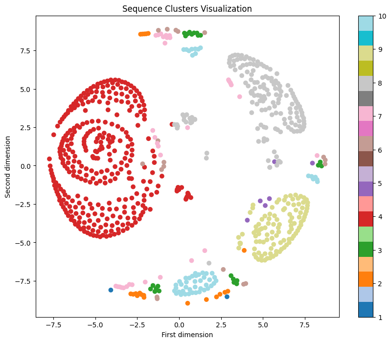

# Clustering based on drug use sequences similarity

In this section I tried to find medication patterns based on the similarity of the drug use sequences among people.

I filtered out the records with N06A drugs (Antidepressants), and then sampled 1000 people for analysis.

At first, I construct the drug use sequences for each person by recording what drugs are used on each day (one digit is recorded for each different drug on each day, the absence of drug use on each day is recorded as 0 in the sequence). Then I used the edit distance to compare the similarity between two sequences. Then I performed clustering based on the similarity score. The clustering result is not good. It seems that constructing sequences with every day's drug use information make the sequences too long and complex to compare and edit distance may not be good for comparing similarity of drug use sequences.

Then I tried another strategy of constructing sequences. In the drug use sequence for each person, each drug era is recorded as one digit, a no-drug period more than 2 months is recorded as 0 and a no-drug period less than 2 months is ignored. The assumption here is that one has recovered if there is no drug use for more than 2 months (this may be further adjusted as one drug era stops if one has not used the same drug for more than 1 month). 

For calculating similarity scores, I defined a metric based on each person's last used drug and the abandoned drugs in each treatment period (segmented by no-drug periods more than 2 months). 

Then again I performed clustering based on the similarity scores. The clutering result is shown below. From the figure below we can see that there is distinct clustering among people with different drug use patterns.

Figure: Clustering result of drug use sequences. Note that dimensions on the plot are just simplified representations for visualization.

Below are the detailed samples from the clustering results. We can see that people within the same cluster indeed have similar medication patterns, especially ending drugs in each treatment period.

The numbers in the sequences are mapped with unique drugs. The mapping is also shown below.

| ATC Code | Number | Drug Name |
|-----------|---------|-----------|
| N06AA09 | 1 | Amitriptyline |
| N06AB04 | 2 | Citalopram |
| N06AB06 | 3 | Sertraline |
| N06AX16 | 4 | Venlafaxine |
| N06AA07 | 5 | Amoxapine |
| N06AB05 | 6 | Paroxetine |
| N06AB03 | 7 | Fluoxetine |
| N06AA16 | 8 | Dosulepin |
| N06AX11 | 9 | Mirtazapine |

## Clusering Results

**Cluster 1: 2 sequences**  
Sample sequences:
  1. [6, 5]
  2. [5]

**Cluster 2: 20 sequences**  
Sample sequences:
  1. [6, 6]
  2. [7, 6]
  3. [6]
  4. [8, 6, 0, 6, 6, 0, 5]
  5. [6, 6, 0, 6, 0, 7, 0, 7]

**Cluster 3: 23 sequences**  
Sample sequences:
  1. [9, 9, 9, 9]
  2. [9]
  3. [7, 9]
  4. [9]
  5. [9, 9]

**Cluster 4: 336 sequences**  
Sample sequences:
  1. [1]
  2. [1]
  3. [1, 1, 1]
  4. [1]
  5. [1, 1, 1, 0, 1, 0, 1, 1]

**Cluster 5: 6 sequences**  
Sample sequences:
  1. [2, 7, 9, 0, 7]
  2. [1, 4, 0, 7, 0, 7, 0, 9]
  3. [7, 7, 0, 7, 0, 7, 4, 4]
  4. [6, 9, 0, 4, 0, 4]
  5. [7, 1, 1, 4, 0, 7, 0, 2]

**Cluster 6: 18 sequences**  
Sample sequences:
  1. [4, 4, 0, 1]
  2. [4, 4, 0, 1, 0, 1]
  3. [4, 4, 4, 4, 0, 4, 4]
  4. [2, 4]
  5. [7, 4, 4]

**Cluster 7: 33 sequences**  
Sample sequences:
  1. [8]
  2. [8]
  3. [1, 8]
  4. [8]
  5. [8, 8, 0, 9]

**Cluster 8: 157 sequences**  
Sample sequences:
  1. [8, 2, 0, 2, 2]
  2. [3, 2, 0, 2, 9, 9, 0, 9]
  3. [2, 2]
  4. [2, 2, 0, 1]
  5. [3, 2, 0, 2, 0, 2]

**Cluster 9: 105 sequences**  
Sample sequences:
  1. [7]
  2. [7]
  3. [2, 7, 0, 7]
  4. [7]
  5. [7]

**Cluster 10: 54 sequences**  
Sample sequences:
  1. [2, 3]
  2. [7, 3]
  3. [3]
  4. [3]
  5. [3]

